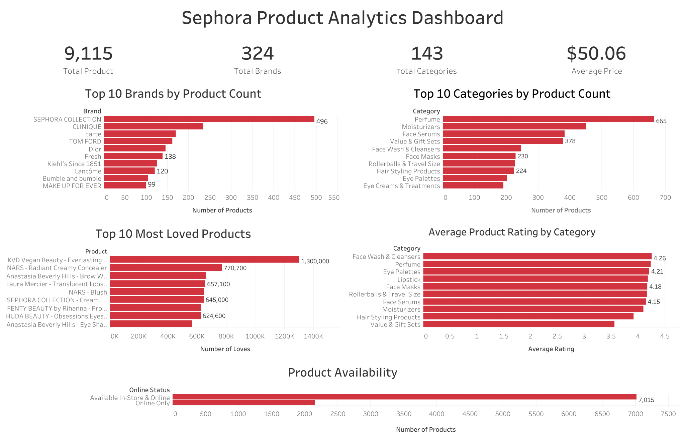

# Sephora Product Analytics



## Project Overview

This project analyzes Sephora product data to identify trends in product assortment, pricing, ratings, customer engagement, and product availability.

I used **PostgreSQL** to clean, explore, and analyze the data and **Tableau** to create a dashboard that summarizes the main findings.

The dataset contains **9,168 product records**, representing **324 brands** and **143 product categories**.

## Tools Used

- **PostgreSQL / SQL** — data cleaning, exploration, and analysis
- **Tableau** — dashboard development and data visualization
- **CSV** — source dataset

## Business Questions

This project explores questions such as:

- Which brands offer the largest number of products?
- Which product categories have the most products?
- Which products receive the most customer engagement?
- Which products have the highest ratings?
- Do higher-priced products receive better ratings?
- Which brands and categories have the highest average ratings?
- How does product availability differ between online-only and in-store/online products?

## Key Insights

- **SEPHORA COLLECTION** has the largest product assortment with **496 products**.
- **Perfume** is the largest product category with **665 products**.
- **KVD Vegan Beauty's Everlasting Liquid Lipstick** is the most-loved product in the dataset with approximately **1.3 million loves**.
- The average product price is approximately **$50.06**.
- Most products are available both **in store and online**, while a smaller portion are **online only**.

## Dashboard

The Tableau dashboard provides a visual overview of Sephora's product catalog and customer engagement.

It includes:

- Total products, brands, and categories
- Average product price
- Top 10 brands by product count
- Top 10 categories by product count
- Top 10 most-loved products
- Average product rating by category
- Product availability

## Repository Structure

```text
sephora-product-analytics/
├── data/
│   └── sephora_website_dataset.csv
├── images/
│   └── sephora_product_analytics_dashboard.png
├── sql/
│   ├── 01_create_table.sql
│   ├── 02_import_data.sql
│   ├── 03_data_cleaning.sql
│   ├── 04_exploratory_analysis.sql
│   └── 05_business_questions.sql
├── tableau/
│   └── Sephora_Product_Analytics.twb
├── .gitignore
└── README.md
```

## SQL Workflow

The SQL scripts are numbered in the order they should be used:

1. **01_create_table.sql**  
   Creates the `sephora_products` table.

2. **02_import_data.sql**  
   Imports the Sephora CSV dataset into PostgreSQL.

3. **03_data_cleaning.sql**  
   Checks record counts, missing values, and duplicate records.

4. **04_exploratory_analysis.sql**  
   Explores product distribution, pricing, ratings, customer engagement, availability, and brand performance.

5. **05_business_questions.sql**  
   Answers business-focused questions using SQL.

## Data Cleaning and Validation

The data validation process included:

- Checking the total number of records
- Checking important columns for missing values
- Investigating repeated product names
- Comparing total rows with fully distinct rows
- Verifying that repeated product names represented different product listings

No exact duplicate records were found in the dataset.

## Dataset

The dataset used in this project is the **Sephora Website Dataset** created by Raghad Alharbi and published on Kaggle.

The dataset contains **9,168 Sephora product records** with information including brand, category, price, rating, number of reviews, customer loves, and product availability.

**Source:** [Sephora Website Dataset – Kaggle](https://www.kaggle.com/datasets/raghadalharbi/all-products-available-on-sephora-website)

## Author

**Carmen Montoya**

Information Technology student interested in data analytics, cloud technology, and technical project management.
